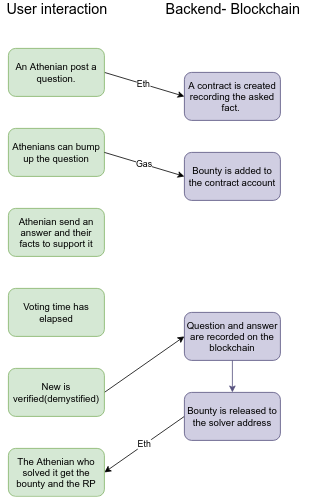

# Athena Fact Checker

Fake News is running rampant. Everyday we are bombarded with dubious claims and questionable statistics. With the emergence of blockchain technologies, we have the power to work as a community to verify the authenticity of the news we read, hear, and watch.

Our goal is to create an open source dapp where users can pose questions (and attach references for those questions) based on online news to the community and have verified users determine the veracity of that news providing sources to support their answers.

The project was started for the [#Blockternship 2018](https://github.com/Blockternship).
 
## The Dapp
Users will be able to determine whether the answers given are accurate, dispute answers, give follow-ups to answers or bump a question if they find that it deserves more attention.
Each community member that actively participates will also have a reputation within the platform and the more they accurately answer questions and provide accurate sources, the higher their reputation will be.

Working on the Ethereum blockchain provides inmutability once an element is recorded on the blockchain and gives us the ability to create an economy to regulate the participation on the app.
Through a simple web interface, users enter the Athena Dapp and are able to interact with the ethereum blockchain. Each question is stored on the blockchain along with the votes, and when the fact get verified, the answer get stored along with the given info.

#### Key features:
 - Important interactions are recorded on the blockchain.   
 - Users are commited to give real answers One-account-per-person autheticationm (BrightId, Telegram Passport).
 - Balanced tokenomics.
 - Extendable to other fields, not just news.  

Dapp is under development. There are some topics where we lack expertise or where we need extensive testing.
- Tokenomics (Ensuring it is well balanced to avoid most of failure cases)
- Security
	- How much can we record on the blockchain.
	- Security considerations on codebase (solidity). 

### License

